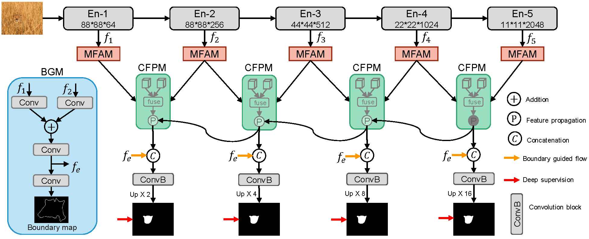
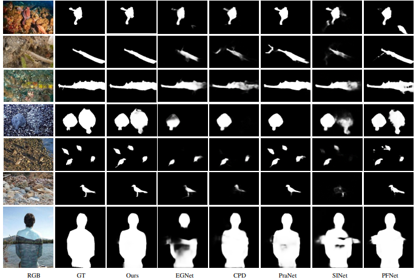

# Feature Aggregation and Propagation Network for Camouflaged Object Detection

> **Authors:** 
> [*Tao Zhou*](https://taozh2017.github.io),
> [*Yi Zhou*](https://cse.seu.edu.cn/2021/0303/c23024a362239/page.htm),
> [*Chen Gong*](https://gcatnjust.github.io/ChenGong/index.html),
> [*Jian Yang*](https://scholar.google.com.hk/citations?user=6CIDtZQAAAAJ&hl=zh-CN),
> and [*Yu Zhang*](https://scholar.google.com.hk/citations?user=oDrTEi0AAAAJ&hl=zh-CN).

## 1. Preface

- This repository provides code for "_**Feature Aggregation and Propagation Network for Camouflaged Object Detection**_" IEEE TIP 2022. [Paper](https://ieeexplore.ieee.org/abstract/document/9940173/) 

## 2. Overview

### 2.1. Introduction

Camouflaged object detection (COD) aims to detect/segment camouflaged objects embedded in the environment, which has attracted increasing attention over the past decades.
Although several COD methods have been developed, they still suffer from unsatisfactory performance due to the intrinsic similarities between the foreground objects and background surroundings. In this paper, we propose a novel Feature Aggregation
and Propagation Network (FAP-Net) for camouflaged object detection. Specifically, we propose a Boundary Guidance Module (BGM) to explicitly model the boundary characteristic, which can provide boundary-enhanced features to boost the COD performance. To capture the scale variations of the camouflaged objects, we propose a Multi-scale Feature Aggregation Module (MFAM) to characterize the multi-scale information from
each layer and obtain the aggregated feature representations. Furthermore, we propose a Cross-level Fusion and Propagation Module (CFPM). In the CFPM, the feature fusion part can effectively integrate the features from adjacent layers to exploit the cross-level correlations, and the feature propagation part can transmit valuable context information from the encoder to the decoder network via a gate unit. Finally, we formulate a unified
and end-to-end trainable framework where cross-level features can be effectively fused and propagated for capturing rich context information. Extensive experiments on three benchmark camouflaged datasets demonstrate that our FAP-Net outperforms other state-of-the-art COD models. Moreover, our model can be extended to the polyp segmentation task, and the comparison
results further validate the effectiveness of the proposed model in segmenting polyps.

### 2.2. Framework Overview

      
    <em> 
    Figure 1: The overall architecture of the proposed FAP-Net, consisting of three key components, i.e., boundary guidance module, multi-scale feature aggregation module, and cross-level fusion and propagation module.
    </em>

### 2.3. Qualitative Results

      
    <em> 
    Figure 2: Qualitative Results.
    </em>

## 3. Proposed Method

### 3.1. Training/Testing

The training and testing experiments are conducted using [PyTorch](https://github.com/pytorch/pytorch) with one NVIDIA Tesla P40 GPU of 24 GB Memory.

1. Configuring your environment (Prerequisites):
       
    + Installing necessary packages: `pip install -r requirements.txt`.

1. Downloading necessary data:

    + downloading training dataset and move it into `./data/`, 
    which can be found from [Google Drive](https://drive.google.com/file/d/1Kifp7I0n9dlWKXXNIbN7kgyokoRY4Yz7/view?usp=sharing) or [Baidu Drive](https://pan.baidu.com/s/1uyQz0b_r_5yCee0orSw7EA) (extraction code: fapn). 

    + downloading testing dataset and move it into `./data/`, 
    which can be found from [Google Drive](https://drive.google.com/file/d/1SLRB5Wg1Hdy7CQ74s3mTQ3ChhjFRSFdZ/view?usp=sharing) or [Baidu Drive](https://pan.baidu.com/s/1F3tVEWYzKYp5NBv3cjiaAg) (extraction code: fapn). 
        
    + downloading our weights and move it into `./checkpoints/FAPNet.pth`, 
    which can be found from [Google Drive](https://drive.google.com/file/d/1qjb70ZGwExei21x6uMQbUAwZ0Ts4Z-xk/view?usp=share_link) or [(Baidu Drive)](https://pan.baidu.com/s/1BeRx81XNKq_jA7LHut1VZg) (extraction code: fapn). .
    
    + downloading Res2Net weights and move it into `./lib/res2net50_v1b_26w_4s-3cf99910.pth`,
    which can be found from [Google Drive](https://drive.google.com/file/d/1_1N-cx1UpRQo7Ybsjno1PAg4KE1T9e5J/view?usp=sharing) or [Baidu Drive](https://pan.baidu.com/s/1gDNNh7Cad3jv2l7i4_V33Q) (extraction code: fapn). 

1. Training Configuration:

    + After you download training dataset, just run `train.py` to train our model.

1. Testing Configuration:

    + After you download all the pre-trained model and testing dataset, just run `test.py` to generate the final prediction maps.
    
    + You can also download prediction maps from [Google Drive](https://drive.google.com/file/d/1O5gDTBasHWuwPv4hxd04Nt08y16_Y578/view?usp=sharing) or [Baidu Drive](https://pan.baidu.com/s/1nltTLWnU3YZpCQO5LewAIw) (extraction code: fapn)).
    

### 3.2 Evaluating your trained model:

One evaluation is written in MATLAB code ([link](https://github.com/DengPingFan/CODToolbox)), 
please follow this the instructions in `./eval/main.m` and just run it to generate the evaluation results in.

## 4. Citation

Please cite our paper if you find the work useful, thanks!
	
	@article{zhou2022feature,
	   title={Feature Aggregation and Propagation Network for Camouflaged Object Detection},
	   author={Zhou, Tao and Zhou, Yi and Gong, Chen and Yang, Jian and Zhang, Yu},
	   journal={IEEE Transactions on Image Processing},
	   volume={31},
	   pages={7036--7047},
	   year={2022},
	   publisher={IEEE}
	}

**[⬆ back to top](#1-preface)**
